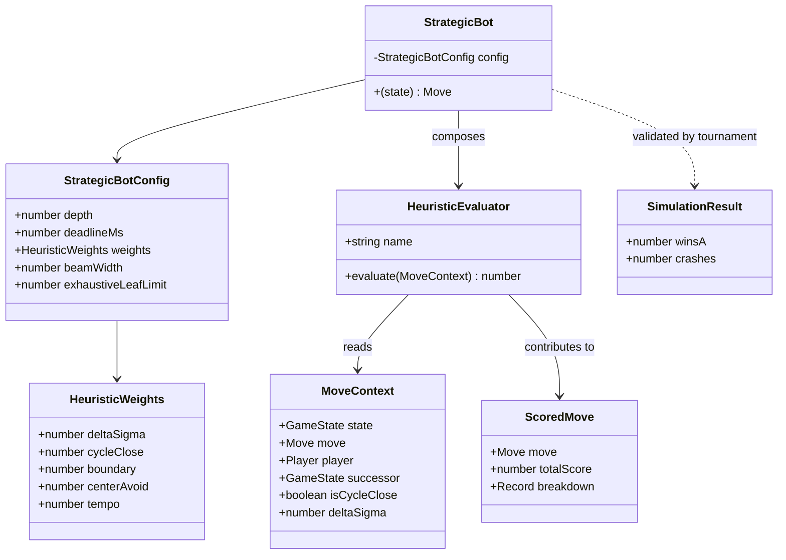

# Phase 1 Data Model: Game-Theoretic Bot

The Strategic bot introduces **no persistent or mutable state**. Every entity below is
either an immutable input/output value or a pure function. All types use `readonly`
fields per Constitution VI. Existing engine types (`GameState`, `Move`, `Coin`, `Edge`,
`Position`, `Player`, `CoinFace`) are reused unchanged.

---

## Entities

### StrategicBot (function value)

The new bot. Conforms to the existing `BotFunction = (state: GameState) => Move`.

| Field / Aspect | Type | Notes |
|----------------|------|-------|
| signature | `(state: GameState) => Move` | Pure, synchronous, deterministic (FR-002). |
| optional config | `StrategicBotConfig` | Internal; default-constructed. Allows tests to override depth/deadline/weights. |
| determinism | — | Same `state` + same config ⇒ same `Move`, via the R6 comparator + stable sort. |
| guarantees | — | Never returns an illegal move; never throws for a state with ≥1 legal move (SC-003). |

```ts
interface StrategicBotConfig {
  readonly depth: number;            // default SEARCH_DEPTH (3)
  readonly weights: HeuristicWeights;
  readonly beamWidth: number;        // default K_BEAM (12); Infinity disables beam
  readonly exhaustiveLeafLimit: number; // default EXHAUSTIVE_LEAF_LIMIT (200)
  // Timeout via dependency injection (Q8 / research R4). Both omitted by default ⇒
  // no time dependence ⇒ pure & deterministic. The UI injects these; core never
  // references performance/Date.
  readonly now?: () => number;       // injected monotonic clock (UI passes performance.now)
  readonly deadlineMs?: number;      // default DEFAULT_DEADLINE_MS (2000) WHEN now is provided
}
```

**Validation rules**:
- `depth >= 1`, `beamWidth >= 1`, `exhaustiveLeafLimit >= 0`.
- `weights` is a complete `HeuristicWeights` record (no missing keys).
- Timeout is active **iff** `now` is provided; then `deadlineMs > 0` is required.
- With `now` omitted, the bot is referentially transparent (Constitution I/VI, FR-002).

---

### HeuristicWeights (constant record)

Exported tunable constants from `weights.ts` (Q3 hand-tuned; final values locked after
tournament). See research R8 for initial values and provenance.

```ts
interface HeuristicWeights {
  readonly sigma: number;          // W_SIGMA — dominant leaf base term (σ heads−tails)
  readonly boundary: number;       // W_BOUNDARY — leaf positional
  readonly centerAvoid: number;    // W_CENTER_AVOID — leaf positional
  readonly tempo: number;          // W_TEMPO — leaf positional
  readonly deltaSigma: number;     // W_DELTA_SIGMA — move ordering / static fallback only
  readonly cycleClose: number;     // W_CYCLE_CLOSE — move ordering / static fallback only
}
```

Per Clarification Q7, the **leaf evaluation** `v(state)` sums only the state-based terms
(`sigma`, `boundary`, `centerAvoid`, `tempo`). `deltaSigma`/`cycleClose` are applied to
**moves** for ordering, beam ranking, and the depth-0 static fallback — they are never
re-added into `v(state)` (the σ swing is already captured by the successor's σ).

---

### HeuristicEvaluator (function value)

A named, composable scorer for one game-theoretic principle. Each maps to exactly one
analysis principle (SC-004: locatable in <30s by matching name).

```ts
// Two shapes (Q7): leaf evaluators score a POSITION; ordering evaluators score a MOVE.
type LeafEvaluator     = (state: GameState, player: Player) => number; // raw, pre-weight
type OrderingEvaluator = (ctx: MoveContext) => number;                  // raw, pre-weight

interface NamedEvaluator {
  readonly name: string;          // e.g. "boundarySafety", "deltaSigma"
  readonly domain: "leaf" | "ordering";
  readonly evaluate: LeafEvaluator | OrderingEvaluator;
}
```

| Evaluator (name) | Domain | Role | Implements (§) | Raw score semantics |
|------------------|--------|------|----------------|---------------------|
| `sigmaTerm` | state | **leaf** | §2, §6 | `σ_signed(state)` — exact margin, side-to-move perspective (dominant base). |
| `boundarySafety` | state | **leaf** | §9a | + for own coins on corners/edges (flip-resistant); positional. |
| `centerExposure` | state | **leaf** | §9a | − for own coins in rows/cols 2–4 (enclosable); positional. |
| `tempo` | state | **leaf** | §9b, §9d | + when neither side has a +2 non-cycle JOIN and a PLACE remains (defer-JOIN edge). |
| `deltaSigma` | move | ordering only | §3, §4 | `+2 / 0 / −2` from endpoint faces, side-to-move perspective. |
| `cycleClose` | move | ordering only | §3, §9b | `2(t − h)` swing of the enclosed region, side-to-move perspective. |

> **Domain note (Q7)**: leaf evaluators take the *state* (`v(state)` sums them); ordering
> evaluators take a `MoveContext`. This is the U1 resolution — no move-delta is summed
> into the leaf, so cycle/Δσ value enters only through the search backup.

**Validation rules**: each evaluator is pure and returns a finite number; 0 means
"neutral" (used by the FR-008 all-zero fallback detector).

---

### MoveContext (immutable input to evaluators)

Bundles everything an evaluator needs so heuristics don't recompute shared facts.

```ts
interface MoveContext {
  readonly state: GameState;          // pre-move state
  readonly move: Move;                // candidate
  readonly player: Player;            // side to move (state.currentPlayer)
  readonly successor: GameState;      // applyMove(state, move) — computed once
  readonly isCycleClose: boolean;     // findCycle(state, a, b) !== null (JOIN only)
  readonly deltaSigma: number;        // sigma(successor) − sigma(state), side perspective
}
```

**Lifecycle / state transitions**: none — `MoveContext` is constructed once per
candidate at the search root (and at interior nodes for beam ranking) and discarded.

---

### ScoredMove (intermediate value)

Output of leaf/static evaluation; consumed by the comparator and `inspectTopMoves`.

```ts
interface ScoredMove {
  readonly move: Move;
  readonly totalScore: number;                 // weighted sum (FR-007) or minimax value
  readonly breakdown: Readonly<Record<string, HeuristicContribution>>;
  readonly moveTypeRank: 0 | 1 | 2;            // 0=cycle JOIN, 1=non-cycle JOIN, 2=PLACE
  readonly orderKey: string;                   // lexicographic position key for tie-break
}

interface HeuristicContribution {
  readonly raw: number;       // evaluator output, pre-weight
  readonly weighted: number;  // raw * weight
}
```

**Validation rules**: `totalScore === Σ breakdown[*].weighted` (for the static leaf
case); `moveTypeRank`/`orderKey` fully determine ordering among equal `totalScore`
(R6). For minimax-derived values, `totalScore` is the backed-up subgame value and
`breakdown` reflects the *leaf* that produced the principal variation's root child.

---

### SearchNode (transient, internal to search.ts)

Not exported. Represents a node during negamax; carries no mutable shared state.

```ts
interface SearchResult {
  readonly value: number;        // negamax value, side-to-move perspective
  readonly bestMove: Move | null;// null only at terminal/forced-pass leaves
  readonly completed: boolean;   // false if cut off by deadline (R4)
}
```

**State transitions modeled**: PLACE / non-cycle JOIN / cycle-closing JOIN via
`applyMove`; forced `PASS` when `allLegalMoves` is empty and `passCount < 2`
(R5, depth not decremented); terminal when `passCount >= 2`.

---

### InspectionResult (exported output of inspectTopMoves)

```ts
interface InspectedMove {
  readonly move: Move;
  readonly totalScore: number;
  readonly breakdown: Readonly<Record<string, HeuristicContribution>>;
}
// inspectTopMoves(state, n): readonly InspectedMove[]   // length = min(n, candidateCount)
```

**Validation rules** (FR-011, R9): result is sorted by the R6 comparator; length is
`min(n, |candidates|)`; **`state` is not mutated** (property-tested via deep equality).

---

### BotTournamentResult (reused, unchanged)

The existing `SimulationResult` from `src/core/bots/simulate.ts` already captures the
required aggregates. No new type is needed (DRY).

```ts
interface SimulationResult {            // existing
  readonly winsA: number;               // maps to Strategic when botA = strategicBot
  readonly winsB: number;
  readonly draws: number;
  readonly crashes: number;             // SC-003: must be 0
  readonly totalGames: number;
}
```

**Note**: `crashes` covers both thrown errors and illegal-move rejections (a rejected
move surfaces as a `step` error → thrown in `advanceGame` → counted as a crash). The
tournament test (SC-001/SC-003) asserts `crashes === 0` and `winsA − winsB > 0` with
`winsA / (winsA + winsB) ≥ 0.55`.

---

## Entity Relationships


