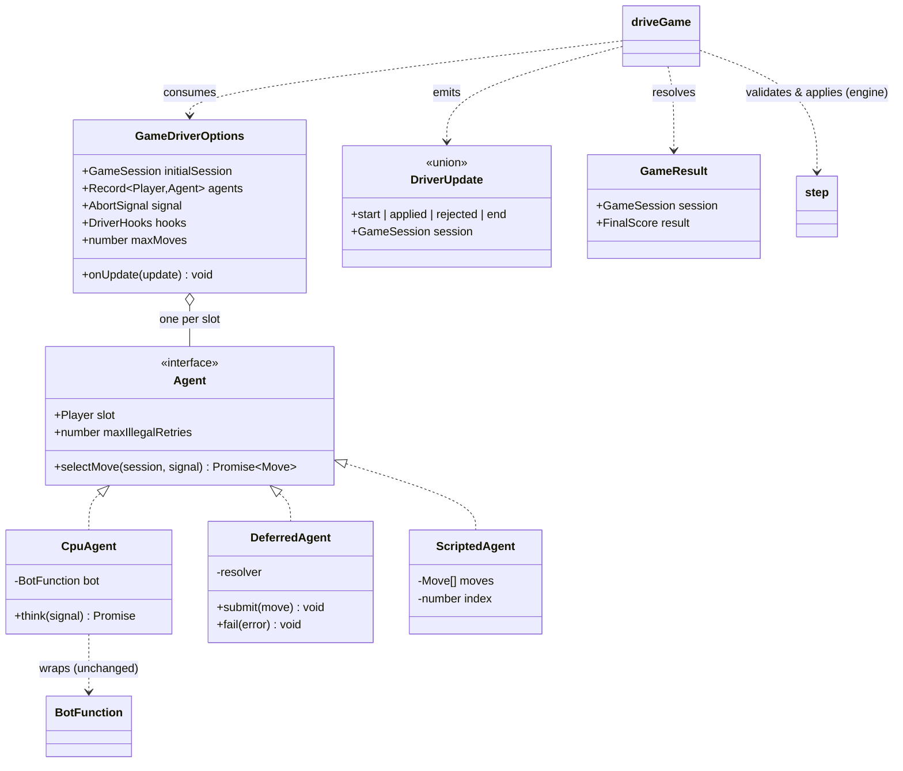

# Phase 1 Data Model: Player & Game-Driver Abstraction

This feature introduces **no game state** and **no persistence**. Every entity is an immutable
value, a pure function, or a small control object holding only transient orchestration state (a
deferred promise resolver). All fields are `readonly` per Constitution VI. Existing engine types
(`GameSession`, `GameState`, `Move`, `Player`, `FinalScore`, `StepResult`) are reused unchanged.

The new code lives in `src/core/driver/` and is re-exported through the `@core` barrel.

---

## Agent (interface)

The single move-source abstraction (research R1). Binds a board slot to an asynchronous move
producer. Implemented by `CpuAgent`, `DeferredAgent`, `ScriptedAgent`, and any future
remote/MCP agent — with no driver change required (FR-010).

```ts
interface Agent {
  /** The slot this agent plays. Reuses the existing engine type ("HEADS" | "TAILS"). */
  readonly slot: Player;

  /**
   * Produce this slot's next move for `session`. May resolve immediately (CPU/scripted) or after
   * awaiting external input (human/remote). MUST reject if `signal` aborts. MUST NOT mutate `session`.
   */
  selectMove(session: GameSession, signal?: AbortSignal): Promise<Move>;

  /**
   * Max consecutive engine-rejected moves before the driver fails loud for this agent.
   * Default (when omitted) = 1 → programmatic agents fail loud on a bug. Interactive agents are
   * fed only legal moves by their embedder (UI pre-validates), so they do not rely on this.
   */
  readonly maxIllegalRetries?: number;
}
```

**Validation / invariants**:
- `selectMove` resolves with a `Move` (PLACE/JOIN/PASS) or rejects (abort or genuine failure).
- The driver — not the agent — decides legality (via `step`) and turn order (via `session.state.currentPlayer`); an agent is never asked on a slot other than its own.
- `selectMove` is never called for a forced-pass turn (the driver auto-passes — FR-004).
- Purity: an agent that performs I/O (future remote/MCP) lives outside `src/core/`; the in-core agents are framework-free.

---

## GameDriverOptions (input to `driveGame`)

```ts
interface GameDriverOptions {
  readonly initialSession: GameSession;            // usually createSession({ firstPlayer })
  readonly agents: Readonly<Record<Player, Agent>>;// exactly one agent per slot; agents[slot].slot === slot
  readonly onUpdate?: (update: DriverUpdate) => void; // observer: render / broadcast each step
  readonly signal?: AbortSignal;                   // cancellation (undo/reset/teardown)
  readonly hooks?: DriverHooks;                    // optional UI pacing injection (engine stays timing-free)
  readonly maxMoves?: number;                      // safety bound; default MAX_MOVES (200)
}

interface DriverHooks {
  /** Awaited before the driver applies a forced PASS. UI sets the notice + delays 1s; headless omits. */
  readonly beforeForcedPass?: (slot: Player, signal: AbortSignal | undefined) => void | Promise<void>;
}
```

**Validation rules**:
- `agents.HEADS` and `agents.TAILS` are both present; `agents[s].slot === s` for each slot (asserted at entry).
- `maxMoves >= 1`; the loop throws `DriverError` if it is exceeded (statically-bounded loop, FR-014).
- `onUpdate`/`signal`/`hooks` are optional; with all omitted, `driveGame` is a pure headless runner.

---

## DriverUpdate (emitted to `onUpdate`)

A discriminated union describing each observable step. Embedders map it to rendering (UI),
printing (CLI), or broadcasting (future server). Flip sets are **not** included — embedders that
animate compute them by diffing the previous session they hold (reuse `findFlippedCoins`, R7).

```ts
type DriverUpdate =
  | { readonly kind: "start";    readonly session: GameSession }
  | { readonly kind: "applied";  readonly session: GameSession; readonly move: Move; readonly slot: Player; readonly forced: boolean }
  | { readonly kind: "rejected"; readonly session: GameSession; readonly slot: Player; readonly move: Move; readonly error: string }
  | { readonly kind: "end";      readonly session: GameSession; readonly result: FinalScore };
```

| kind | When | Notes |
|------|------|-------|
| `start` | once, before the loop | carries `initialSession` |
| `applied` | after each successful `step` | `forced: true` for an auto-pass; `session` is post-move |
| `rejected` | an agent move failed `step` validation | driver re-asks the same slot (bounded) |
| `end` | when `session.isTerminal` | `result` from `computeFinalScore` |

**Invariant**: the sequence is always `start (applied|rejected)* end` (or terminates early via abort,
which throws from `driveGame` rather than emitting `end`).

---

## GameResult (resolved value of `driveGame`)

```ts
interface GameResult {
  readonly session: GameSession;  // terminal session (isTerminal === true)
  readonly result: FinalScore;    // { heads, tails, winner } — equals computeFinalScore(session)
}
```

**Validation rules**: `session.isTerminal === true`; `result` is consistent with the engine
(FR-006). On abort, `driveGame` **rejects** with an `AbortError` (no `GameResult`).

---

## DriverError (thrown failure)

```ts
class DriverError extends Error {
  readonly code: "illegal-move-limit" | "max-moves-exceeded" | "bad-agents";
}
```

Thrown for: a programmatic agent exhausting `maxIllegalRetries` (SC-007), the `maxMoves` safety bound
being hit (FR-014), or a malformed `agents` map. Abort is **not** a `DriverError` — it surfaces as the
standard `AbortError` so callers can distinguish cancellation from failure. (Explicit error typing per
the "no generic catch-all" rule.)

---

## CpuAgent (factory + value)

Wraps an existing synchronous `BotFunction` as an `Agent` (FR-009, R6).

```ts
interface CpuAgentOptions {
  /** Optional pre-move pacing, injected at the UI boundary (engine stays timing-free). */
  readonly think?: (signal: AbortSignal | undefined) => Promise<void>;
}
function createCpuAgent(slot: Player, bot: BotFunction, options?: CpuAgentOptions): Agent;
// selectMove: await options.think?.(signal); signal?.throwIfAborted(); return bot(session.state);
```

| Aspect | Value |
|--------|-------|
| `slot` | as provided |
| `maxIllegalRetries` | `1` (a bot returning an illegal move is a bug → fail loud) |
| determinism | inherits the wrapped bot's (e.g. `strategicBot` is deterministic with no clock injected) |
| purity | pure when `think` is omitted; the UI supplies `think = (s) => delay(2000, s)` |

**Validation**: `bot` is a `BotFunction`; the agent never returns `PASS` (bots never choose PASS; forced
passes are driver-owned).

---

## DeferredAgent (factory + handle)

An `Agent` whose move arrives later, via an external `submit` — the human input channel, and the shape a
future remote agent takes (R7).

```ts
interface DeferredHandle {
  readonly agent: Agent;
  /** Resolve the currently-awaited selectMove with `move`. No-op if none is awaiting. */
  submit(move: Move): void;
  /** Reject the currently-awaited selectMove (e.g. transport error). */
  fail(error: Error): void;
}
function createDeferredAgent(slot: Player, options?: { readonly maxIllegalRetries?: number }): DeferredHandle;
```

| Aspect | Value |
|--------|-------|
| `selectMove` | returns a promise stored internally; resolves on `submit`, rejects on `fail` or `signal` abort |
| transient state | at most one pending `{ resolve, reject }` resolver + an abort listener — **not** game state |
| `maxIllegalRetries` | default `1`; the UI pre-validates so it never trips in normal play (R5) |

**Validation / invariants**: only one move is awaited at a time (the driver asks one slot at a time); a
`submit` with no pending request is a no-op; on abort the pending promise rejects and the resolver is cleared
(no leak, no stale resolution → SC-006).

---

## ScriptedAgent (factory + value)

Plays a fixed list of moves — for deterministic headless tests and replay (FR-012).

```ts
function createScriptedAgent(slot: Player, moves: readonly Move[]): Agent;
// selectMove: returns the next move in sequence; throws DriverError if the list is exhausted.
```

| Aspect | Value |
|--------|-------|
| `slot` | as provided |
| `maxIllegalRetries` | `1` (a script that yields an illegal move is a test bug → fail loud) |
| determinism | total (no randomness, no clock) |

**Validation**: advancing past the end throws (a scripted game must supply enough moves to reach terminal,
or be paired with a partner that ends it).

---

## Entity Relationships


